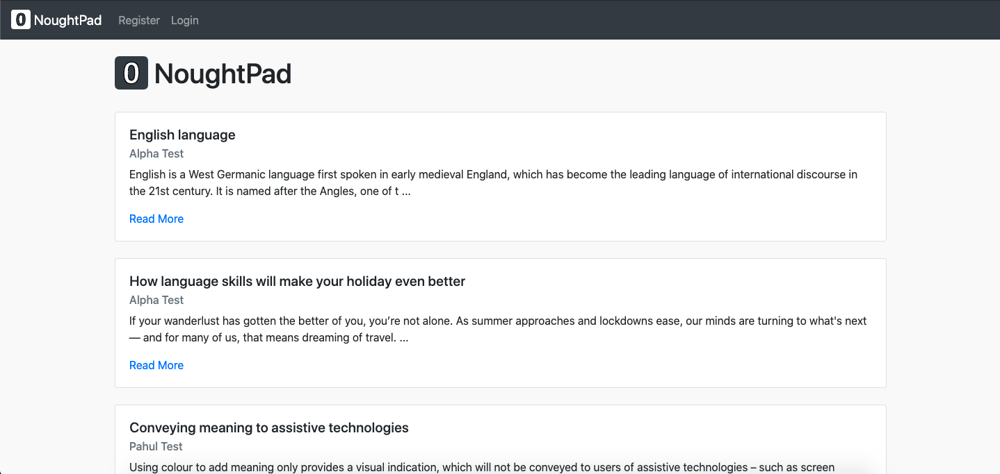
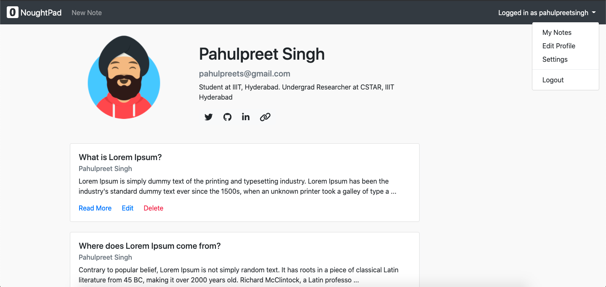

# NoughtPad <!-- omit in toc -->

This is a basic blog website made using Django and Bootstrap.

## Table of Contents <!-- omit in toc -->
- [Features](#features)
- [Screenshots](#screenshots)
- [Technologies](#technologies)
- [Setup Instructions](#setup-instructions)
- [Project Status](#project-status)
- [Contributions](#contributions)
- [Sources](#sources)

## Features

- Sign-in/Sign-up
- Adding, Editing, Deleting Notes
  - Using RichText in Note body
  - Uploading header images in Notes
- Liking anyone's Notes
- Author page
  - Profile card with profile picture, bio and external links
  - All Notes posted by the author
- Edit profile/user settings

## Screenshots




## Technologies

This project is built with:

* [Django 3.2.4](https://www.djangoproject.com/)
* [Bootstrap 4.4.1](https://getbootstrap.com/docs/4.4/getting-started/introduction/)

## Setup Instructions

Clone the repository:
```sh
$ git clone https://github.com/codelixir/nought-pad.git
$ cd nought-pad
```
Now if you wish, you can create ans activate a virtual environment (recommended). Then install the dependencies:
```sh
$ pip3 install -r requirements.txt
```
Once `pip` has finished downloading, you can run the server:
```sh
$ python3 manage.py runserver
```
and navigate to `http://127.0.0.1:8000/`

## Project Status

I will not be working on this project for now, but there are a number of improvements that can be made. For example:

- [ ] Making the navbar sticky
- [ ] Improving responsiveness
- [ ] Adding dark mode
- [ ] Making a separate profile page
- [ ] Option to upload in-text images in notes
- [ ] Adding comments to notes
- [ ] Adding categories to notes

## Contributions

Want to contribute? Awesome!

To fix a bug or add/enhance a feature (out of those listed above, or anything else you find interesting), follow these steps:

- Fork the repo
- Create a new branch (`git checkout -b improve-feature`)
- Make the appropriate changes in the files
- Add changes to reflect the changes made
- Commit your changes (`git commit -am 'Improve feature'`)
- Push to the branch (`git push origin improve-feature`)
- Create a Pull Request

If you want to add a feature not listed under [project status](#project-status), please open an issue [here](https://github.com/codelixir/nought-pad/issues/new) before working on it.

## Sources

This project is inspired by a Django tutorials playlist by [Codemy](https://codemy.com/).

---
[](https://forthebadge.com)